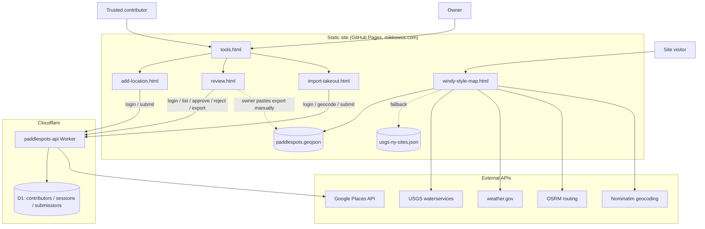

# mikkowus.github.io

Static site (served at [mikkowus.com](https://mikkowus.com) via GitHub Pages)
for finding NY paddle spots, with live USGS gauge heights and NWS weather/wind
overlaid on a Leaflet map. No build step — the HTML files are served as-is.

## Pages

- **index.html** — landing page, links to the main map.
- **windy-style-map.html** — the main map: NY USGS gauges on one clustered
  layer, paddlespots on another (independently toggleable, with GPS paddling
  routes on a third toggleable layer), click-anywhere wind lookup, a "My
  Position" locate button, optional radar/forecast overlay, and
  drive-time-to-spot lookups.
- **tools.html** — small hub linking the three contributor/owner tools below
  (not linked from the map itself, just a shared bookmark).
- **add-location.html** — mobile-friendly page for trusted contributors to log
  in and submit new paddlespots (GPS capture or tap-to-place-pin), with
  offline queueing via `offline-queue.js` + `sw.js`. Backed by the Cloudflare
  Worker in `worker/`.
- **review.html** — owner-only page to approve/reject pending submissions
  (from `add-location.html` or `import-takeout.html`) and export approved
  ones as GeoJSON to paste into `paddlespots.geojson`.
- **import-takeout.html** — owner-only page to bulk-import a Google Takeout
  Maps list CSV: classifies rows, geocodes named places via the Worker's
  `/api/import/geocode` endpoint (Google Places API), filters to NY, dedupes
  against the live dataset, and submits the survivors into the same
  pending-review queue as `add-location.html`.
- **shared.js** — fetch/parsing helpers (USGS sites, water height, NWS
  weather, OSRM routing, Nominatim geocoding) shared by `windy-style-map.html`,
  `add-location.html`, `review.html`, and `import-takeout.html`, with
  in-memory caching so repeated popup opens don't re-hit the same APIs.

## Architecture

The Worker never writes to `paddlespots.geojson` (or the repo) directly —
every path from a submission to the live dataset goes through the owner
reviewing in `review.html` and merging the export by hand through a normal
PR, same as any other change to this repo.

## Data pipeline

**Paddlespots** (`paddlespots.geojson`, loaded by `windy-style-map.html`) is
the one canonical dataset — name, description, region, water body name/type,
access type, parking notes, tags, an optional `nearest_gauge_site_no` (surfaced
as a live water-height reading in its popup), an optional `source_url`, and
optional linked GPS routes under `tracks/*.gpx` (rendered via the
`leaflet-gpx` plugin on the "Routes" layer). Most entries are real but sparse
(name + coordinates only) — `region`/`water_body_name`/`water_body_type`/etc.
are enrichable over time, not required. Run `python3 scripts/validate_paddlespots.py`
after editing the file by hand.

It was built up in a few passes:
- A handful of entries were hand-curated first (rich metadata, manually
  verified coordinates).
- The bulk (~90 more) came from a one-time import (`scripts/import_paddlespots_data.py`)
  of a real Google Takeout "Saved" export of the "Paddlespots" Maps list,
  processed by a separate tool (`~/projects/2026_google_saved_data_extraction`)
  into resolved lat/lng + any saved notes. Filtered to New York, deduplicated
  against the hand-curated entries and against each other (by exact match and
  by proximity — some places were saved more than once, sometimes under a
  different title that happened to resolve to the same real place).
- `paddlespots_coordinates.csv` / `googlePinsScraperTool/` are an earlier,
  now-superseded scraping pipeline for the same underlying list — no longer
  loaded by the live site, kept as historical reference. See
  `scripts/README.md` for the full lineage.

For any *future* Takeout export, use `import-takeout.html` instead of
re-running the one-time script — same NY-filtering, geocoding, and dedup
logic, but through the UI and into the pending-review queue rather than
writing to the file directly.

**USGS gauge fallback** (`usgs-ny-sites.json`, used when the live USGS API is
unreachable): generated from `usgs_ny.rdb` by `scripts/parse_usgs_rdb.py`.
Re-download the `.rdb` and re-run that script to refresh it.
